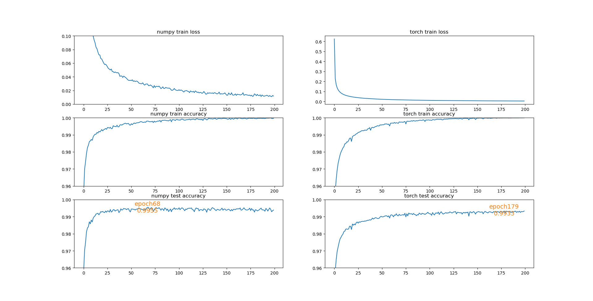

# ResNet9 numpy mnist

This repo contains an implementation of [MNIST classification](https://yann.lecun.com/exdb/mnist/) , and the difference between this repo and many other repo is:

* this repo is mainly using numpy (rather than PyTorch or tensorflow), for someone who wants to know more of fundamentals of deep learning.
* this repo not just using an MLP, it has CNN, skip connections and so on.

This is one of our homeworks, and it was finished with the help of ChatGPT 3.5, **but** I have to say that the output code is very **formatted**, but cannot work even after many prompting. After making it work, several hours were taken to adjust hyper-parameters. 

There are many files here, which are the evolutions of the final script (can be helpful for many beginnners ^_^).

## performance

测试集准确率99.55%

## Loss curve

## Dependency

cupy & numpy

`pip install cupy-cuda12x`

to draw these figs,

`torch, matplotlib` are used

## Implementation

`Convblock, Resblock, Maxpooling, Avgpooling, Dropout, softmax, relu, cross_entropy_loss`, all these `forward` and its corresponding `backward`.

## Experiments

Mnist, 60000 for train, 10000 for test.

Hyperparameter:

Batchsize: 64, so every epoch has 938 iterations

learning rate: 1e-4

dropout rate: 0.9

epochs_max: 200

## Failure case

The first row is the input images, second row is combination of wrong predictions, third row is combination of labels

## Try the code

After installing all dependencies(site-packages), run

`python mnist_maxpool_weightdecay.py`

Parameters, log files, backups will be saved at `../save/20241019`, you can modify variable `tag` for diffenent folders.

The pytorch version, run

`cd torch_version`

`python resnet9_torch.py`

And to show the results (just like this report) , after training, run

`python plot_figs.py`

## Other statements

In our implementation of `MaxPooling2D`, a mask that records the position of max indices of forward process is used, then passed into backward process. It is possible that, a sub block has 2 values, they all equal to the max value, a conservative choise is to randomly choose one, but we make the mask of all these positions into 1——for simplification.

The dropout rate is an interesting parameter, we found even 99% droprate can achieve >99% accuracy, but more easy to collapse. And in our experiment, we tried 0.5, 0.6, 0.7, 0.8, 0.9, 0.95, 0.99 droprate, 0.9 can achieve the highest test accuracy (99.55%)
